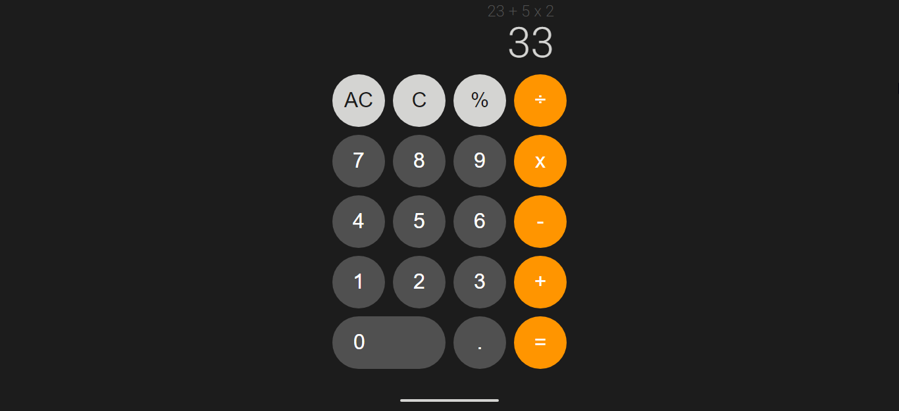

# calculator

A simple calculator app that uses iphone-inspired color scheme and theme

## How It Works
* You can click the buttons or use your keyboard to get calculations
* This app accepts multiple operands and operators, and solve them according to operator precedence (MDAS).
* It accepts percentage and decimals in operands too.
* The algorithm consist of parsing the expression text's operators and operands and and arrange them through postfix notation before computing them to follow operator procedence rule.

## Screenshots

